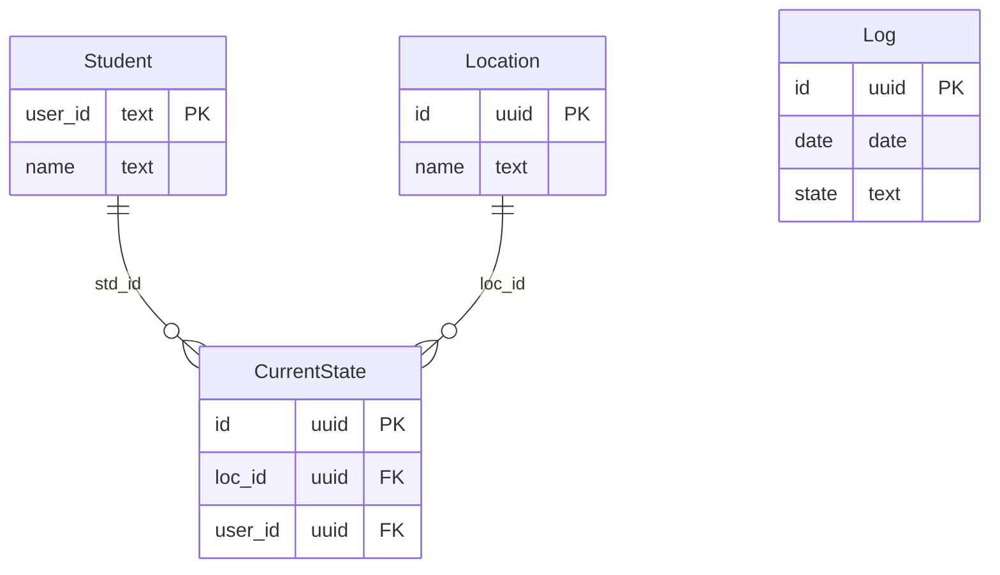

# 프론트


# 백엔드

- 학생
  - 학원에 들어왔는 지 확인이 되어야함.
  - 학원의 어느 방에 있는 지 정보를 보내야함.
  - 몇시에 학원에 들어왔고, 몇시에 나갔는지 기록되어야함.
  - 학원생들 각각이 로그인되어야 함.
- 선생
  - 학원생들이 현재 몇명 들어와있는 지 확인이 되어야함.
  - 학원생들이 어느 방에 있는 지 확인되어야함. (맵과 테이블 둘 다)
    - 각 학원생이 어느 방에 있는 지
    - 각 방에 어느 학원생이 있는 지


# DB 구조




# Todo

- 프론트
  - [ ] 테이블로 학원생들 표현하기
    - [ ] 기본 테이블 기능
    - [ ] 필터기능
    - [ ] 펼치기 접기 기능
  - [ ] 맵으로 학원생들 표현하기
    - [ ] 기본 맵 기능
    - [ ] 방을 눌렀을 때 해당 방에 있는 학생들 정보 보이기
  - [ ] 학원생 검색 기능
- [ ] 백엔드
  - [ ] 특정 방에 학원생 누가 있는 지 쿼리
  - [ ] 특정 검색어에 대한 학원생 쿼리
  - [ ] 학원생이 어느 방에 있는 지 쿼리
  - [ ] 각 방에 학원생 몇명이 있는 지 전체 쿼리
  - [ ] 각 방에 학원생들 전체 정보 쿼리


# 기술 스택

- remix
- WebSocket


# 동작 방법

```bash
pnpm i
pnpm build
pnpm start
```